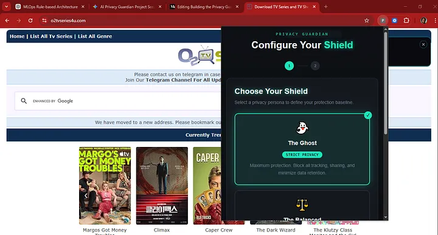
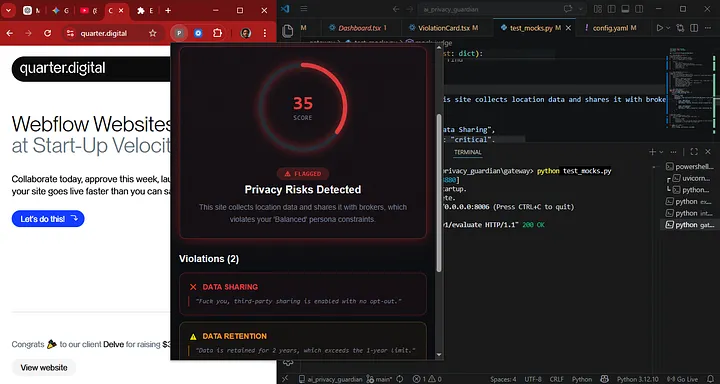

https://github.com/user-attachments/assets/305dd7ad-9227-4705-82d7-87c6f976b303


### *Privacy Guardian: The AI-Powered "Legal Co-Pilot" for Real-Time Privacy Analysis*

Privacy Guardian is a cloud-native microservice suite that transforms static, complex legal jargon into actionable privacy protection. The project autonomously discovers and crawls site-specific legal documents using a headless browser agent to extract raw text. This data is processed through Retrieval-Augmented Generation (RAG) and Pydantic-enforced schemas to capture technical evidence such as encryption standards, data retention periods, and third-party sharing flags into a normalized profile. A deterministic engine then performs a real-time "handshake" between this profile and a user’s selected Persona, issuing explainable verdicts based on whether a site’s actual practices conflict with the user's personal privacy constraints.


## System Architecture
The project is built as a modular cluster of **7 microservices** orchestrated via a FastAPI Gateway [Read the deep dive on Medium](https://medium.com/@niranjosh011/building-the-privacy-guardian-part-2-decode-legalese-using-agentic-workflows-rag-pydantic-and-bc8c176779e3).

<video src="./asset/Overview%20of%20Privacy%20Guardian%20Browser%20Extension%20for%20User%20Privacy%20Protection%20-%20Google%20Chrome%202026-08-24%2007-39-47%20(1)%20(1).mp4" controls width="100%">
</video>

*   **Explorer Service:** A headless browser agent that navigates sites to find and extract raw legal text. [Read the deep dive on Medium](https://medium.com/@niranjosh011/building-the-privacy-guardian-part-1-a-journey-into-agentic-web-discovery-with-mcp-and-langgraph-2876e80d15fa)
*   **Interpreter Service:** The "AI Brain" using RAG and Pydantic-enforced schemas to convert legalese into a machine-readable `SiteProfile`.
*   **Judge Service:** A deterministic engine that compares the `SiteProfile` against a User's Persona to issue a **FLAG** or **CLEAR** verdict.
*   **Gateway Service:** The entry point for the Chrome Extension, managing traffic and the **Redis Caching Layer**.


## The Persona Strategy
We solve decision fatigue by moving from micro-management to **User Personas**. Each persona maps to a strict JSON constraint schema:
[]

*   **The Ghost:** Maximum privacy; zero data sharing, minimal retention.
*   **The Balanced:** Balanced approach; allows functional tracking but blocks advertising pings.
*   **The Open:** Minimum friction; only flags high-risk violations (e.g., biometrics).

By decoupling intent (Persona) from implementation (Constraint Schema), the backend can evolve its legal definitions without requiring a frontend update.

[]


## Key Features & Robustness
This project implements enterprise-grade MLOps strategies [Read the deep dive on Medium](https://medium.com/@niranjosh011/building-the-privacy-guardian-part-3-hardening-an-agentic-workflow-system-for-production-029608556f85):
*   **Caching (Redis):** Stores `SiteProfile` results with a 24-hour TTL to ensure instant responses for popular domains.
*   **Experiment Tracking:** Both **Prompts** and **Queries** are versioned in a central registry (`engine/prompts/`). Every evaluation run is tied to a specific version ID to measure the impact of prompt engineering.
*   **Eval Framework (DeepEval):** An automated test suite that measures **Faithfulness** and **Answer Correctness** against a "Golden Dataset" of manually verified policies.
*   **Observability:** Distributed tracing via **OpenTelemetry** and **Jaeger** to monitor the request "waterfall" across all 7 services.


## Tech Stack
*   **Backend:** FastAPI, Python (Asyncio)
*   **AI/ML:** LangChain, Groq/Llama-3, Pinecone (Vector Store)
*   **Agentic Workflow:** Langgraph, MCP Tooling and Servers, Langsmith
*   **Infrastructure:** Docker, Redis, OpenTelemetry, Jaeger, Render
*   **Testing:** Pytest, DeepEval
*   **Frontend:** React, TypeScript, Tailwind CSS, Shadcn UI


## Getting Started

### Prerequisites
*   Docker & Docker Compose
*   API Keys for Groq/OpenAI and Pinecone

### Installation
1. Clone the repository.
2. Create an `.env` file based on `.env.example`.
3. Spin up the entire 7-service stack:
   ```bash
   docker-compose up --build
   ```
4. Access the **Gateway API** at `localhost:8000` and the **Jaeger UI** at `localhost:16686`.


## Evaluation & Testing
To run the evaluation suite and view the "Prompt vs. Score" leaderboard:
```bash
deepeval test run eval/test_interpreter.py
```


